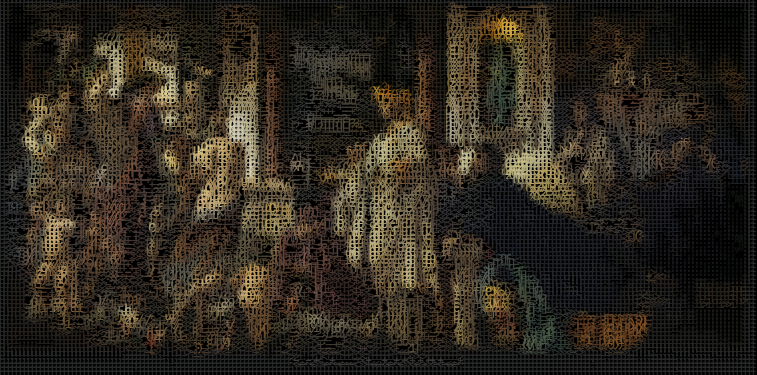

# JANUS

<p align="center">
  
</p>

<p align="center">
  <em>"Two faces looking in opposite directions—one sees the past, one sees the future.<br>The god of beginnings, transitions, and endings."</em>
</p>

---

## 

Janus is a multi-model AI orchestration system. Three frontier models—Claude Opus 4.5 , ChatGPT 5.2 Codex, Gemini 3 PRO, collaborate, deliberate, form consensus in real-time on your request. You watch them think. You see where they agree. You see where they disagree. They propose solutions and you decide..

**The watching is the feature.**

This isn't a black box. This isn't "trust the AI." This is a symposium where the smartest minds in the room happen to be artificial, and you're Socrates with the wine cup, guiding the conversation toward truth.

---

## Why?

Because I've been waiting since 1999 for machines smart enough to be worth arguing with. Now they're here, and the tools we have treat them like oracles—you ask, they answer, you accept or reject in ignorance.

That's not collaboration. That's superstition.

Karpathy said it best:

> *"I don't want an agent that goes off for 20 minutes and comes back with 1,000 lines of code. I want to work in chunks I can keep in my head, where the LLM explains what it's writing."*

Janus takes this further: **multiple LLMs explaining to each other, in front of you, so you can see the shape of the problem emerge from their disagreement.**

When Claude says "this is risky" and GPT says "this is fine," that delta isn't noise—it's signal. Surface it. Don't suppress it.

---

## The Council

```
┌─────────────────────────────────────────────────────────────┐
│                        YOU (Arbiter)                        │
│                                                             │
│    "Tell me about authentication approaches for this API"   │
└─────────────────────────────────────────────────────────────┘
                              │
                              ▼
┌─────────────────────────────────────────────────────────────┐
│                      THE COUNCIL                            │
├──────────────────┬──────────────────┬───────────────────────┤
│   CLAUDE OPUS    │   GPT-5.1        │   GEMINI 3 PRO        │
│   (Synthesis)    │   (Reasoning)    │   (Breadth)           │
│                  │                  │                       │
│  "OAuth 2.0 with │  "JWT with RSA   │  "Consider OAuth but  │
│   PKCE is the    │   signing. The   │   also look at PASETO │
│   standard, but  │   PKCE flow has  │   which addresses JWT │
│   note the token │   known replay   │   shortcomings. Also: │
│   refresh race   │   vulnerabilities│   what's your scale?" │
│   condition..."  │   if..."         │                       │
│                  │                  │                       │
│  Confidence: 85% │  Confidence: 78% │  Confidence: 72%      │
│  Tokens: 847     │  Tokens: 1,203   │  Tokens: 634          │
│  Cost: $0.042    │  Cost: $0.038    │  Cost: $0.019         │
├──────────────────┴──────────────────┴───────────────────────┤
│                                                             │
│  ⚠️  DISAGREEMENT DETECTED                                   │
│  Claude and GPT differ on replay vulnerability assessment   │
│                                                             │
│  [APPROVE Claude's Approach]  [REQUEST CLARIFICATION]       │
│  [SYNTHESIZE ALL THREE]       [ASK DIFFERENT QUESTION]      │
│                                                             │
└─────────────────────────────────────────────────────────────┘
```

Three advisors. Parallel execution. Each shows their work. You see everything.

---

## Core Principles

### 1. Disagreement Is Signal

When models disagree, that's not a bug—it's the most valuable information in the system. Disagreement reveals:
- Edge cases one model sees and another doesn't
- Different priors baked into training
- Genuine uncertainty about the problem

We don't manufacture consensus. We surface divergence.

### 2. The Karpathy Principle

Everything stays in chunks you can hold in your head:
- Proposals are bounded, reviewable, understandable
- No 1,000-line code drops—incremental, explained work
- The human stays in the loop at every meaningful decision
- **You get smarter working with it, not just faster**

### 3. Transparency Over Magic

- Token counts visible at all times
- Cost per query, per model, running total
- Full reasoning chains exposed (yes, even `<thinking>` tags)
- Nothing happens without your approval

### 4. Git Is Truth

All context persists in Git-backed storage:
- Session summaries survive browser closes
- Decisions are logged with rationale
- If it's not in Git, it didn't happen
- *The next Claude that talks to you knows what the last one decided*

---

## Architecture

```
┌─────────────────────────────────────────────────────────────┐
│                    STRATEGIC LAYER                          │
│                    (claude.ai / Opus 4.5)                   │
│                                                             │
│    Strategic planning, architecture decisions, manifesto    │
│    enforcement—the high-bandwidth conversational interface  │
└─────────────────────────────────────────────────────────────┘
                              │
                      Context Bridge
                    (Git-backed state)
                              │
                              ▼
┌─────────────────────────────────────────────────────────────┐
│                    EXECUTION LAYER                          │
│                    (Claude Agent SDK)                       │
│                                                             │
│  ┌─────────────┐  ┌─────────────┐  ┌─────────────┐        │
│  │ Scout Swarm │  │   Council   │  │  Executor   │        │
│  │ (5× Haiku)  │  │  (3 models) │  │   Swarm     │        │
│  │             │  │             │  │ (10× Haiku) │        │
│  │ URL verify  │  │ Deliberate  │  │ Write code  │        │
│  │ Doc check   │  │ Disagree    │  │ Run tests   │        │
│  │ Recon       │  │ Synthesize  │  │ Build       │        │
│  └─────────────┘  └─────────────┘  └─────────────┘        │
└─────────────────────────────────────────────────────────────┘
```

### Context Bridge

The critical innovation. Sessions in claude.ai can't directly invoke SDK agents. The Context Bridge solves this:

```
janus-context/
├── sessions/           # Conversation summaries
├── decisions/          # Key architectural choices
├── state/
│   ├── current-focus.json
│   └── delegations/    # Pending tasks for SDK
├── manifesto/
│   └── MANIFESTO.md    # Rules enforced on all subagents
└── artifacts/          # Generated outputs
```

This is the memory that doesn't die when the browser closes.

---

## Who Is This For?

Practitioners who:
- Have API keys for Claude, GPT, and Gemini
- Are willing to pay $10-50 per complex task for quality orchestration
- Want to **understand**, not just trust
- Believe multi-model collaboration yields insights no single model provides

If you want a magic button that "just works," this isn't it.  
If you want to *see* the thinking, this is.

---

## Status

**Phase 0: Foundation** — In Progress

What exists:
- [x] Vision and architecture documented
- [x] Context Bridge design
- [x] MANIFESTO.md (rules for subagents)
- [ ] TypeScript project scaffolding
- [ ] Basic CLI entry point

What's next:
- [ ] Council deliberation protocol (PROPOSE → CRITIQUE → SYNTHESIZE)
- [ ] Multi-model API adapters (Anthropic, OpenAI, Google)
- [ ] Session management
- [ ] Git-backed persistence
- [ ] Observable deliberation UI

See [ARCHITECTURE.md](./ARCHITECTURE.md) for the full implementation roadmap.

---

## The Name

Janus: Roman god of doorways, beginnings, transitions. Two faces—one looking to the past (what we've built, what we know), one to the future (what we're building, what we don't yet understand).

Also: the name fits a multi-perspective system. Different faces, same deity. Different models, same truth we're hunting.

---

## Philosophy (or: Why I Built This)

I've been following AI since before it was cool. Read Kurzweil in '99. Watched the winters. Watched the spring. Now we're here, and the gap between what these systems can do and what our tools let us *see them doing* is embarrassing.

The rationalists talk about AI alignment. Here's a simpler alignment problem: **aligning human understanding with AI capability.** 

Right now, we treat language models like magic 8-balls. Ask a question, get an answer, have no idea why. That's not partnership—that's cargo cult engineering.

Janus is my attempt to close that gap. Watch the thinking. See the disagreement. Make informed decisions.

This is how I want to work with AI. Maybe you do too.

---

## Contributing

This is early. The architecture is documented, the vision is clear, but the code is nascent.

If you share the vision—observable AI deliberation, human-in-the-loop always, disagreement as signal—reach out. File issues. Send PRs.

---

## License

MIT. Use it, fork it, improve it.

---

<p align="center">
  <em>"The unexamined AI is not worth deploying."</em><br>
  — with apologies to Socrates
</p>
